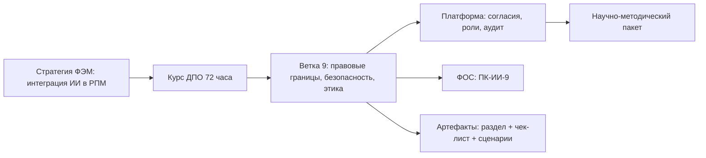
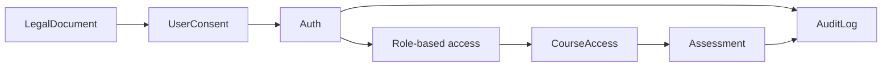
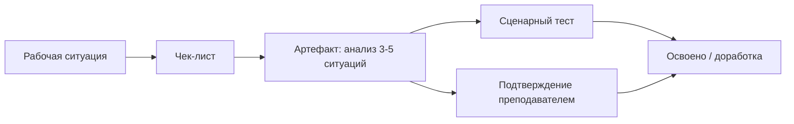
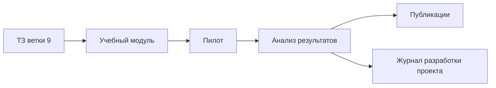

# Демонстрационный отчет

## Ветка 9. Правовые границы, безопасность и профессиональная ответственность применения ИИ преподавателем

Проект: ФЭМ СПБГТИ(ТУ) Образование  
Статус: демонстрационный отчет для внешнего обсуждения  
Дата: 2026-05-28

> Документ не является юридическим заключением. Все положения, требующие нормативной конкретизации, требуют проверки по официальным источникам и внутренним документам образовательной организации.

## Общая логика ветки

## Ключевые выходные файлы

- `09_LEGAL_ETHICS_SECURITY_DPO_AI.md`
- `09_CHECKLIST_SAFE_AI_USE.md`
- `09_TZ_LEGAL_ETHICS_SECURITY_DPO_AI.json`
- `09_TZ_LEGAL_ETHICS_SECURITY_DPO_AI.yaml`

## Платформенный контур

## Зоны риска

| Зона | Пример | Безопасное действие |
|---|---|---|
| Персональные данные | ФИО, оценки, работы студентов | Обезличить или использовать внутренний контур |
| Конфиденциальность | Внутренние документы кафедры | Проверить допустимость внешней обработки |
| Авторское право | Чужие тексты и изображения | Проверить источники и условия использования |
| Академическая добросовестность | Полностью сгенерированная работа | Требовать журнал запросов и авторский вклад |
| Ответственность | Оценивание и учебные материалы | Оставлять итоговое решение за человеком |

## Модель оценки ПК-ИИ-9

## Научно-методический задел

